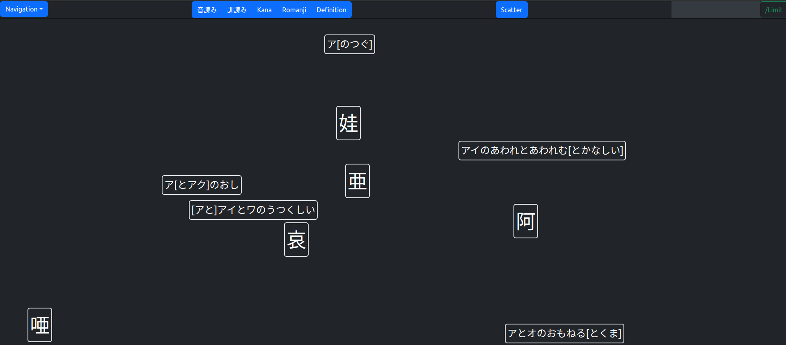

# KanjiFlashcards
A flashcard application for Japanese kanji.

Current branch: implementation

Most recent picture (4/12/23) 
 * Note that the kana option shows my own way of remembering the on-yomi and kun-yomi of a kanji by combining them into one long "name" for the kanji.
 * Multiple on-yomi/kun-yomi readings are separated by と, and on-yomi and kun-yomi readings are separated by の.
 * Brackets denote a reading that jisho.org says is a reading for a kanji, but jisho.org does not provide examples that use the reading.

## Progress Report/Changelog
4/12/23
Implemented:
 - Fixed method of tracking current cards in play by adding a Redux state called "cards" to remember the values of the FlashCard components in play.
 - Changed order of initialization so that lists can be initialized dynamically at the start of the application. Order of initialization:
   - MainView initializes kanjiList and matchList
   - MainView initializes ScatterBoard
   - ScatterBoard initializes cardInPlay
   - ScatterBoard initializes cards (FlashCards)
   - FlashCards are dynamically created one by one, each with a random position on the ScatterBoard
 - Made it so that the ScatterButton is capable of resetting the FlashCards on the board. 
   (Cannot shuffle positions while there are still cards in play; this functionality may be implemented in the future)

Needs to be implemented:
 - Randomization of kanji to create Flashcards from. Given a list of kanji and their matches, should create a random subset of Flashcards from that list
 - NumberSelect component: allow number of current cards in play (x) to be set to the value set in the NumberSelect component (1 <= x <= kanjiList.length)
 - MatchSelect component: disable button on select and set global "type" to the type of the button selected
 - KanjiSelect component: allow selection of SHIFT-JIS rows and individual kanji to be used as FlashCards

4/11/23

Implemented:
 - Drag and drop functionality: can drag a flashcard and drop it anywhere on the ScatterBoard. Attempting to drop the card off screen sets the
   flashcard at the border of the window.

Needs to be Implemented next: refreshing the ScatterBoard with FlashCards
 - A button is planned to be used, but the button must be able to control the state of the ScatterBoard. Currently, there is an object "values" that keeps
   track of the values of the flashcards currently in play, so updating "values" will not affect the state of the ScatterBoard.